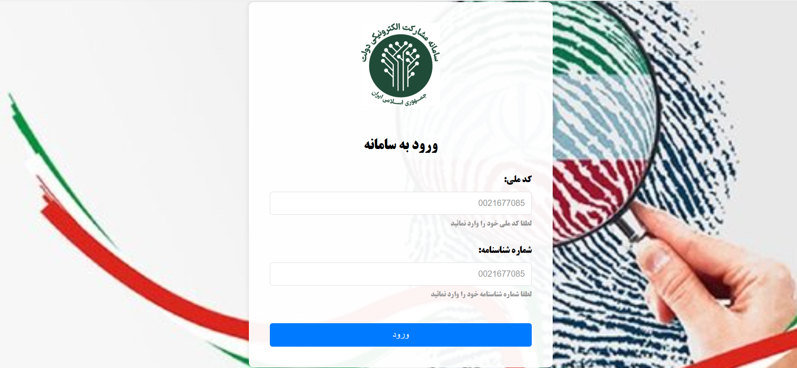
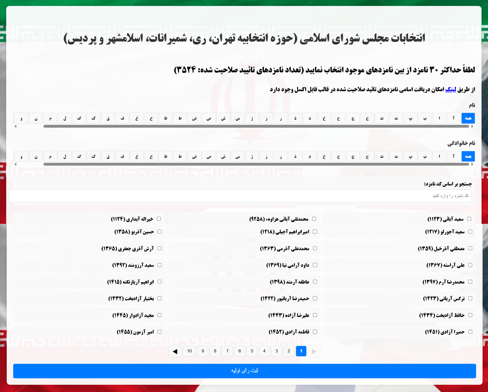
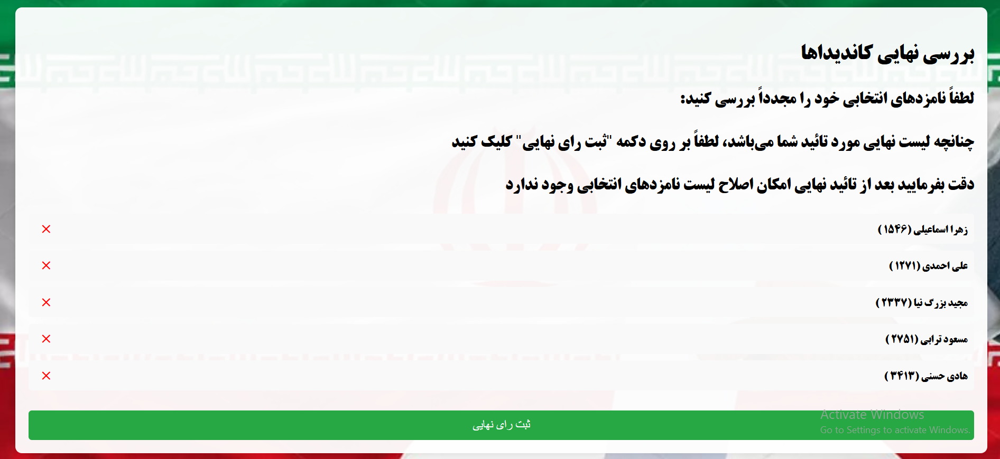

# 🗳️ Voting System Platform

A secure and interactive **web-based voting system** built with **HTML, CSS, and JavaScript**.  
This project simulates a full election workflow — including login, candidate browsing, vote selection, review, and final submission — with a clean RTL interface optimized for Persian text.


---

## 🚀 Features

### Authentication
- 🔐 Login with **National ID** and **Certificate Number**
- Validation with helper messages

### Voting Process
- 📋 Browse candidates with **alphabetical filtering**
- 🔎 **Search** candidates by code
- ✅ Select up to **30 candidates**
- 🔄 **Pagination** for large candidate datasets

### Review & Submission
- 📝 Review selected candidates before submission
- ❌ Remove candidates if needed
- 📊 Submit **final vote** with confirmation page

### Interface
- RTL (Right-to-Left) design for Persian text
- Responsive, clean, and modern UI

---

## 🖥️ Platform Screenshots

### 🔑 Login Page
<p align="center">
  
</p>

### 🗳️ Voting Environment
<p align="center">
  
</p>

### ✅ Review & Final Submission
<p align="center">
  
</p>

<p align="center">
  
</p>

---

## 🎥 Demo

A full workflow demo (Login → Candidate Selection → Review → Final Submission):

<p align="center">
  
</p>

---

## 📋 Requirements

This project is **frontend only** — no backend required.  
It runs directly in the browser with no installation needed.

**Files used in the project:**
- `index.html` – main application
- `candidates_names.csv` – list of candidates
- `background.jpg` – login background
- `logo.jpg` – login logo
- `logo2.jpeg` – voting background
- `finalpage.PNG` – final confirmation page

---

## 🚀 Installation

1. **Clone the repository**
```bash
git clone https://github.com/yourusername/voting-system.git
cd voting-system
